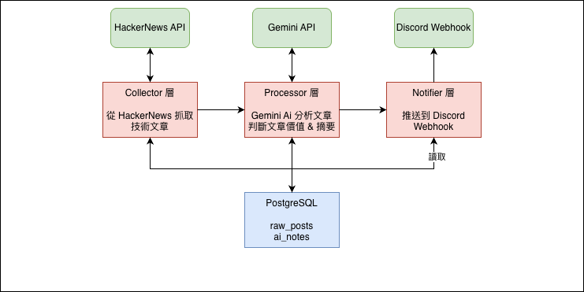
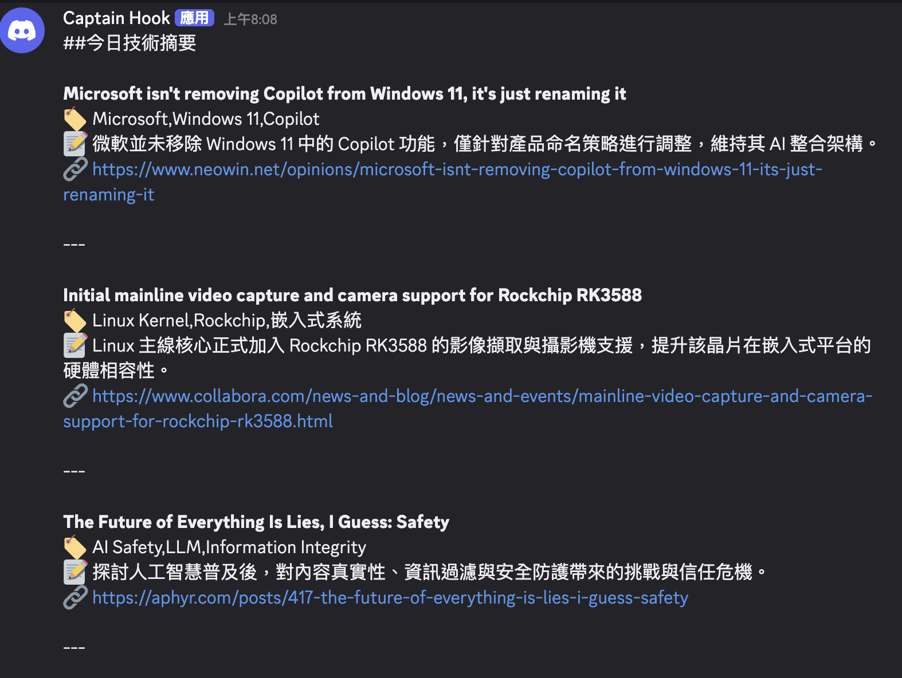

#  AI 技術情報筆記機器人 (ai-tech-notes)

> 每天自動抓取技術社群的熱門文章，透過 AI 過濾與摘要，推送到 Discord 的個人學習頻道。

---

##  為什麼做這個專案？

身為轉職者，我每天面對大量技術資訊卻沒有時間一一閱讀。  
這個專案解決了我自己的痛點：**讓 AI 幫我篩選真正值得看的文章，並整理成中文摘要推送到 Discord**，讓我每天早上打開手機就能掌握技術動態。

---

##  系統架構



**為什麼分三層？**  
每一層只負責一件事（單一職責原則）。Collector 不管 AI 怎麼分析，Processor 不管文章從哪來，Notifier 不管內容怎麼產生。這樣未來要換資料來源（例如從 Reddit 抓）或換通知管道（例如改發 Email），只需要改一層，不會牽一髮動全身。

## 運行結果


---

##  技術棧

| 類別 | 技術 | 選用原因 |
|------|------|----------|
| 語言 / 框架 | Java 21 + Spring Boot 4.0.3 | Virtual Threads 支援高併發，且為最新 LTS 版本 |
| AI 整合 | LangChain4j + Gemini 3.1 Flash-Lite | LangChain4j 提供統一介面，未來換模型不需大改程式碼 |
| 資料庫 | PostgreSQL + Spring Data JPA | 結構化儲存，JPA 自動產生 SQL 減少樣板程式碼 |
| 通知 | Discord Webhook | 設定簡單，個人使用場景最輕量 |
| 排程 | Spring `@Scheduled` | 內建功能，不需引入額外依賴 |

---

##  資料庫設計

```sql
-- 原始文章
raw_posts
├── id          UUID, PRIMARY KEY
├── platform    VARCHAR  -- 資料來源（hackernews / reddit...）
├── author      VARCHAR
├── content     TEXT
├── url         VARCHAR
├── scraped_at  TIMESTAMP
└── is_processed BOOLEAN (已加索引，加速查詢未處理文章)

-- AI 分析結果
ai_notes
├── id          UUID, PRIMARY KEY
├── post_id     UUID, FOREIGN KEY → raw_posts
├── is_valuable BOOLEAN  -- AI 判斷是否值得推送
├── tags        VARCHAR  -- 例如：Java, AI, DevOps
├── summary     TEXT     -- 繁體中文摘要
└── created_at  TIMESTAMP
```

---

##  目前進度

- [x] **Phase 1**：Hacker News 抓取 → AI 分析 → 存入資料庫
- [x] **Phase 2**：Discord Webhook 推送 + 每日排程自動執行
- [x] **Phase 3**：防重複抓取（TDD）+ Docker 化 + AWS 部署（EC2 + RDS）
- [ ] **Phase 4**：RESTful API 重構、is_processed 改為 status-based、錯誤處理機制
- [ ] **Phase 5**：快取層、非同步處理
- [ ] **Phase 6**：使用者系統（驗證機制）

---

##  如何在本地跑起來

**環境需求**
- Java 21
- PostgreSQL
- Gemini API Key（[申請連結](https://aistudio.google.com/)）

**步驟**

```bash
# 1. Clone 專案
git clone https://github.com/KevinChen1115/ai-tech-notes.git
cd ai-tech-notes

# 2. 設定環境變數
cp src/main/resources/application.yml.example src/main/resources/application.yml
# 填入你的 DB 設定與 Gemini API Key

# 3. 啟動
./mvnw spring-boot:run
```

**手動觸發 API**

```bash
# 抓取文章
curl -X POST http://localhost:8080/api/collector/fetch

# AI 分析
curl -X POST http://localhost:8080/api/collector/process/ai

# Discord 推送
curl -X POST http://localhost:8080/api/collector/notify/discord
```

---

##  這個專案學到什麼

- Spring Boot 三層架構設計（Controller / Service / Repository）
- 外部 AI API 整合與 Prompt 設計
- 環境變數管理，敏感資訊不進版本控制
- API 速率限制問題排查與解決方案設計
- Java 21 Virtual Threads 併發處理
- TDD 開發流程與多層次測試策略（單元測試、切片測試、整合測試，共 19 個測試案例）
- Docker 化（Multi-stage Build）後部署至 AWS EC2 + RDS，學習 Security Group 網路安全設定與環境變數管理
---

*這是我轉職 Java 工程師期間的實戰作品集專案，持續更新中。*
